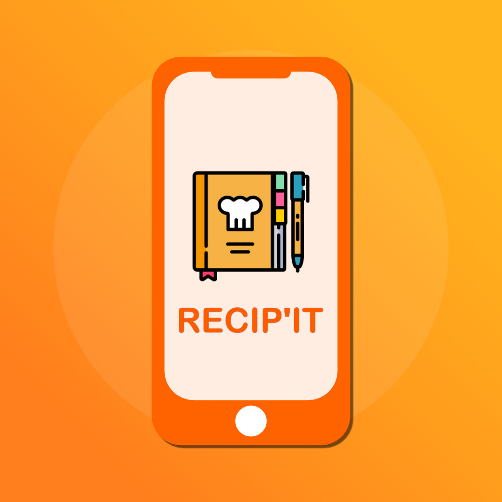

  

# 
 RecipIt 

 A Culinary iOS App for Recipes and Shopping List 

--- 
* Language: Swift, SwiftUI
*  Design Pattern:  MVVM 
---

## iOS Application
RecipIT is a versatile iOS app that simplifies recipe management.

  

## Recipe and Shopping List
Users can create, edit and favorite recipes, while also generating shopping lists for ingredients.

  
  

## Features
With features like picture attachments, RecipIT enhances the culinary experience.

  

